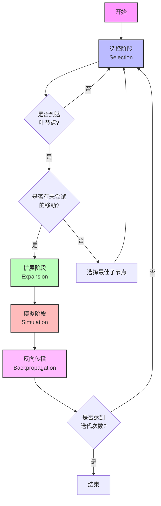
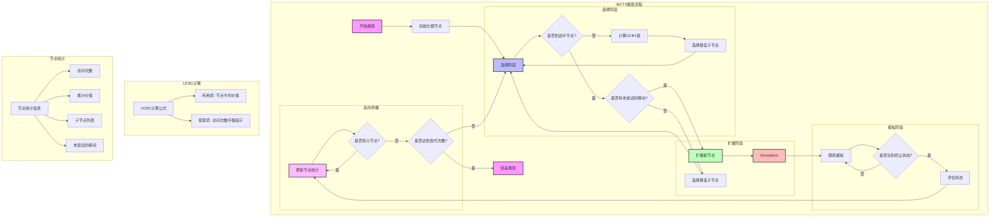
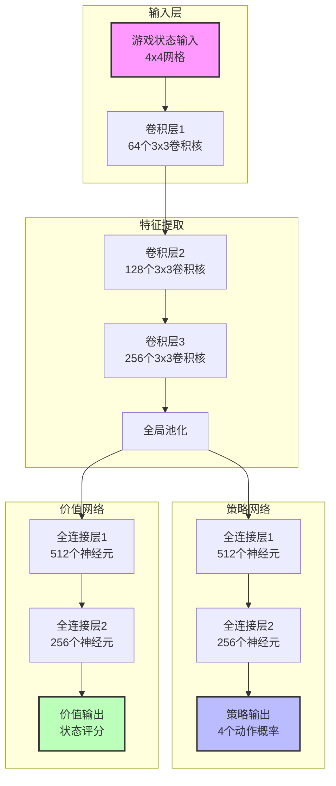

# 2048游戏中的蒙特卡洛树搜索(MCTS)算法剖析

## 1. 算法概述

### 1.1 算法简介
本文档详细说明了在2048游戏中实现的蒙特卡洛树搜索(MCTS)算法。该算法通过模拟大量游戏场景来学习最优策略，主要包含四个关键步骤：选择(Selection)、扩展(Expansion)、模拟(Simulation)和反向传播(Backpropagation)。

### 1.2 MCTS核心流程



上图展示了MCTS算法的核心迭代过程：

1. **选择阶段（Selection）**：
   - 从根节点开始，使用UCB1公式选择子节点
   - 直到达到叶节点或未完全展开的节点

2. **扩展阶段（Expansion）**：
   - 当到达叶节点且有未尝试的移动时
   - 随机选择一个未尝试的移动创建新节点

3. **模拟阶段（Simulation）**：
   - 从新节点开始进行随机模拟
   - 直到达到终止状态

4. **反向传播（Backpropagation）**：
   - 将模拟结果沿路径向上传播
   - 更新节点访问次数和累计价值

这个过程会不断重复，直到达到预定的迭代次数。

### 1.3 算法演进历史

MCTS算法的发展历程可以追溯到以下几个关键阶段：

1. **UCB1算法的提出 (2002)**
   - 论文：Auer, P., Cesa-Bianchi, N., & Fischer, P. (2002). "Finite-time Analysis of the Multiarmed Bandit Problem"
   - 贡献：提出了UCB1公式，解决了探索与利用的平衡问题
   - 影响：为MCTS的选择策略奠定了理论基础

2. **UCT算法的诞生 (2006)**
   - 论文：Kocsis, L., & Szepesvári, C. (2006). "Bandit Based Monte-Carlo Planning"
   - 贡献：将UCB1应用于树搜索，形成了UCT (Upper Confidence bounds for Trees)算法
   - 创新：首次将多臂赌博机理论应用于树搜索问题
   - 应用：在围棋等游戏中取得了突破性进展

3. **RAVE (Rapid Action Value Estimation) 的引入 (2006)**
   - 论文：Gelly, S., & Silver, D. (2007). "Combining Online and Offline Knowledge in UCT"
   - 贡献：提出了快速动作价值估计方法
   - 改进：显著提高了算法的学习效率
   - 应用：在围棋程序中得到广泛应用

4. **PUCT (Predictor + UCT) 的发展 (2012)**
   - 论文：Silver, D., et al. (2012). "A General Reinforcement Learning Algorithm that Masters Chess, Shogi, and Go through Self-play"
   - 贡献：结合了神经网络预测器与UCT
   - 创新：引入了先验知识来指导搜索
   - 影响：为AlphaGo等突破性AI系统奠定了基础

5. **现代MCTS的优化 (2015-至今)**
   - 主要改进：
     - 并行化搜索策略
     - 树重用技术
     - 自适应参数调整
     - 混合评估函数
   - 应用：在各类游戏AI和实际决策问题中广泛应用

### 1.4 在2048游戏中的MCTS

#### 1.4.1 游戏核心目标分析

2048游戏的核心目标是在有限的空间内（4x4网格）通过合并相同数字来获得尽可能大的数字（理想目标是2048或更高）。从算法优化的角度来看，这个目标可以分解为以下几个关键方面：

1. **空间管理**
   - 核心挑战：在4x4的有限空间内管理数字的分布
   - 关键指标：
     * 空格数量：保持足够的移动空间
     * 数字分布：避免数字过于分散
     * 合并机会：最大化相邻相同数字的合并机会
   - 优化方向：评估函数需要关注空间利用效率

2. **数字增长**
   - 核心挑战：通过合并实现数字的指数级增长（2→4→8→...→2048）
   - 关键指标：
     * 最大数字：当前最大数字的值
     * 数字分布：相邻数字的差异程度
     * 合并效率：每次移动的合并收益
   - 优化方向：评估函数需要平衡短期合并收益和长期增长潜力

3. **结构维护**
   - 核心挑战：维护有利于持续合并的数字结构
   - 关键指标：
     * 单调性：数字的递增/递减程度
     * 平滑性：相邻数字的差异
     * 角落策略：大数字的位置管理
   - 优化方向：评估函数需要引导形成稳定的数字结构

4. **风险控制**
   - 核心挑战：避免游戏提前结束
   - 关键指标：
     * 移动空间：确保始终有可用移动
     * 数字分布：避免形成难以合并的孤立数字
     * 结构稳定性：防止结构崩溃
   - 优化方向：评估函数需要包含风险预警机制

基于以上分析，MCTS算法在2048游戏中的优化目标可以总结为：
1. **短期目标**：最大化每次移动的合并收益，保持足够的移动空间
2. **中期目标**：形成并维护有利于持续合并的数字结构
3. **长期目标**：实现数字的稳定增长，最终达到2048或更高
4. **约束条件**：在有限空间内平衡各项指标，避免游戏提前结束

这些目标之间存在一定的权衡关系：
- 追求短期合并收益可能影响长期结构
- 维护严格的结构可能限制移动灵活性
- 过度关注大数字可能忽视整体布局
- 过于保守的策略可能错过合并机会

因此，评估函数的设计需要：
1. 综合考虑多个目标
2. 根据游戏阶段动态调整权重
3. 在各项指标之间取得平衡
4. 具备风险预警和纠正机制

1. **混合评估函数**
   
   在2048游戏中，单一的评估函数往往难以全面反映游戏状态的好坏。混合评估函数通过组合多个互补的评估指标，能够更全面地评估游戏状态。主要包含以下几个评估指标：

   a) **单调性评估 (Monotonicity)**
   ```python
   def _calc_monotonicity(self, grid):
       mono = 0
       # 行单调性
       for row in grid:
           mono += self._mono_line(row)
       # 列单调性
       for col in zip(*grid):
           mono += self._mono_line(col)
       return mono

   def _mono_line(self, line):
       inc = dec = 0
       for i in range(3):
           if line[i] > line[i+1]:
               dec += line[i] - line[i+1]
           else:
               inc += line[i+1] - line[i]
       return -min(inc, dec)  # 取负值，因为单调性越高越好
   ```

   单调性评估主要关注数字在行和列上的递增或递减趋势。在2048游戏中，理想的数字排列应该呈现单调递增或递减的模式，这样可以：
   1. 避免大数字被小数字"卡住"
   2. 便于相同数字的合并
   3. 形成稳定的游戏结构

   举例说明：
   ```
   理想的行排列（单调递减）：
   128  64   32   16   得分：-0（完美单调）
   
   不太理想的行排列：
   64   128  32   16   得分：-64（128-64=64的差异）
   
   糟糕的行排列：
   16   128  32   64   得分：-112（128-16=112的差异）
   ```

   计算过程解析：
   1. 对于每一行/列，计算两种单调性：
      - 递增单调性（inc）：从左到右数字递增的程度
      - 递减单调性（dec）：从左到右数字递减的程度
   2. 取两种单调性中的较小值（因为我们要的是严格的单调性）
   3. 取负值（因为差异越小，单调性越好）

   为什么单调性重要：
   1. **合并效率**：单调排列使得相同数字更容易相邻
   2. **移动空间**：大数字在边缘，不会阻碍小数字的移动
   3. **结构稳定**：单调结构不容易被破坏
   4. **合并预测**：便于预测和规划合并路径

   实际游戏中的应用：
   ```
   好的结构（高单调性）：
   1024 512  256  128
   512  256  128   64
   256  128   64   32
   128   64   32   16
   
   差的结构（低单调性）：
   1024  128  512   64
    256   32  128  512
     64  256   32  128
     16   64  256   32
   ```

   在好的结构中：
   - 大数字都在左上角
   - 数字呈现清晰的递减趋势
   - 相同数字容易相邻
   - 移动方向明确（主要向下和向右）

   在差的结构中：
   - 大数字分散
   - 数字大小混乱
   - 合并困难
   - 移动方向不明确

   因此，单调性评估函数通过惩罚数字排列的混乱程度，来引导AI形成有序的游戏结构。这个指标特别适合：
   - 游戏中期：需要形成稳定结构时
   - 大数字管理：需要将大数字保持在边缘时
   - 合并规划：需要预测合并路径时

   b) **平滑性评估 (Smoothness)**
   ```python
   def _calc_smoothness(self, grid):
       smooth = 0
       for i in range(4):
           for j in range(4):
               if grid[i][j] == 0:
                   continue
               v = math.log2(grid[i][j]) if grid[i][j] > 0 else 0
               for dx, dy in [(0,1),(1,0)]:
                   ni, nj = i+dx, j+dy
                   if 0<=ni<4 and 0<=nj<4 and grid[ni][nj]>0:
                       nv = math.log2(grid[ni][nj])
                       smooth -= abs(v-nv)  # 取负值，因为差异越小越好
       return smooth
   ```

   平滑性评估关注相邻数字之间的差异程度，与单调性评估的主要区别在于：

   1. **评估范围**：
      - 单调性：关注整行/整列的数字变化趋势
      - 平滑性：只关注相邻数字之间的差异

   2. **计算方式**：
      - 单调性：计算递增和递减趋势，取较小值
      - 平滑性：直接计算相邻数字的差异绝对值

   3. **评估目的**：
      - 单调性：确保整体结构有序
      - 平滑性：确保相邻数字便于合并

   举例说明：
   ```
   情况1（高平滑性，高单调性）：
   128  64   32   16
   64   32   16    8
   32   16    8    4
   16    8    4    2
   特点：相邻数字差异小，整体趋势清晰

   情况2（高平滑性，低单调性）：
   32   64   32   16
   16   32   16    8
    8   16    8    4
    4    8    4    2
   特点：相邻数字差异小，但整体趋势不明显

   情况3（低平滑性，高单调性）：
   128  32   64   16
   64   16   32    8
   32    8   16    4
   16    4    8    2
   特点：整体趋势清晰，但相邻数字差异大

   情况4（低平滑性，低单调性）：
   128  16   64    8
   32    4   32   16
   64    8   16    4
   16    2    8    2
   特点：相邻数字差异大，整体趋势混乱
   ```

   为什么平滑性重要：
   1. **合并机会**：
      - 相邻数字差异越小，越容易形成可合并的数字对
      - 例如：32和32可以合并，但32和128不能直接合并

   2. **移动效率**：
      - 平滑的数字分布使得移动更有目的性
      - 避免大数字和小数字交错，导致移动受阻

   3. **结构稳定**：
      - 平滑的结构更容易维护
      - 减少数字"跳跃"带来的不确定性

   4. **合并预测**：
      - 便于预测下一步可能的合并
      - 有助于规划合并路径

   平滑性与单调性的协同作用：
   1. **互补关系**：
      - 单调性确保整体结构有序
      - 平滑性确保局部可合并性
      - 两者结合形成更稳定的游戏结构

   2. **不同阶段的作用**：
      - 游戏早期：平滑性更重要（关注合并机会）
      - 游戏中期：两者并重（平衡结构和合并）
      - 游戏后期：单调性更重要（维护大数字结构）

   3. **实际应用示例**：
   ```
   理想状态（高平滑性+高单调性）：
   1024 512  256  128
   512  256  128   64
   256  128   64   32
   128   64   32   16
   特点：
   - 每行/列严格递减（高单调性）
   - 相邻数字差异小（高平滑性）
   - 合并路径清晰
   - 结构稳定

   次优状态（高平滑性但低单调性）：
   512  256  128   64
   256  128   64   32
   128   64   32   16
    64   32   16    8
   特点：
   - 相邻数字差异小（高平滑性）
   - 但整体趋势不够明显（低单调性）
   - 合并机会多
   - 但结构不够稳定
   ```

   因此，平滑性评估函数通过惩罚相邻数字的差异，来引导AI形成便于合并的数字分布。这个指标特别适合：
   - 游戏早期：需要频繁合并时
   - 局部优化：需要改善特定区域的合并机会时
   - 合并规划：需要预测和规划合并路径时

   c) **角落策略 (Corner Strategy)**
   ```python
   def _is_max_in_corner(self, game: Game2048) -> bool:
       max_tile = game.get_max_tile()
       corners = [game.grid[0][0], game.grid[0][3], 
                 game.grid[3][0], game.grid[3][3]]
       return max_tile in corners
   ```

   角落策略是2048游戏中的一个重要策略，其核心思想是将最大数字保持在角落位置。这个策略之所以有效，主要有以下几个原因：

   1. **移动自由度**：
      - 角落位置只有两个移动方向（例如左上角只能向右和向下移动）
      - 这意味着大数字不会"卡住"其他数字的移动
      - 其他位置（如中心）会限制更多方向的移动

   2. **结构稳定性**：
      - 角落位置是网格的"锚点"
      - 大数字在角落可以形成稳定的递减结构
      - 减少了大数字被小数字包围的风险

   3. **合并效率**：
      - 角落位置便于形成有序的合并链
      - 大数字不会阻碍小数字的合并路径
      - 便于规划合并策略

   举例说明不同情况：

   ```
   情况1（理想状态 - 大数字在左上角）：
   1024 512  256  128
   512  256  128   64
   256  128   64   32
   128   64   32   16
   特点：
   - 最大数字(1024)在左上角
   - 形成清晰的递减结构
   - 合并路径明确
   - 移动方向固定（主要向下和向右）

   情况2（次优状态 - 大数字在边缘但非角落）：
   512  1024 256  128
   256  128   64   32
   128   64   32   16
    64   32   16    8
   特点：
   - 最大数字(1024)在边缘但非角落
   - 结构相对稳定
   - 但移动方向不够集中
   - 合并路径可能受限

   情况3（危险状态 - 大数字在中心）：
   256  128   64   32
   128  1024 256  128
    64   32   16    8
    32   16    8    4
   特点：
   - 最大数字(1024)在中心位置
   - 移动方向分散
   - 合并路径复杂
   - 容易形成"卡住"状态

   情况4（最差状态 - 大数字被小数字包围）：
   128   64   32   16
    64  1024  32   64
    32   16    8    4
    16    8    4    2
   特点：
   - 最大数字(1024)被小数字包围
   - 移动严重受限
   - 合并路径受阻
   - 结构不稳定
   ```

   角落策略的实施要点：

   1. **选择角落**：
      - 通常选择左上角作为主要角落
      - 原因：符合人类阅读习惯，便于规划
      - 但其他角落同样有效

   2. **维护策略**：
      - 一旦大数字到达角落，尽量保持其位置
      - 通过控制移动方向来维护结构
      - 避免不必要的移动导致大数字离开角落

   3. **合并规划**：
      - 从角落开始规划合并路径
      - 优先考虑靠近角落的合并
      - 保持数字的递减趋势

   4. **风险控制**：
      - 当大数字不在角落时，优先考虑将其移动到角落
      - 避免大数字被小数字包围
      - 在必要时可以暂时牺牲一些合并机会

   实际游戏中的应用示例：

   ```
   早期阶段（建立角落策略）：
    2    4    2    4
    4    2    4    2
    2    4    2    4
    4    2    4    2
    → 优先将较大的数字（如4）移动到角落
    → 开始形成递减结构

   中期阶段（维护角落策略）：
   128   64   32   16
    64   32   16    8
    32   16    8    4
    16    8    4    2
    → 保持大数字在角落
    → 维护递减结构
    → 规划合并路径

   后期阶段（优化角落策略）：
   1024 512  256  128
    512 256  128   64
    256 128   64   32
    128  64   32   16
    → 保持最大数字在角落
    → 优化合并效率
    → 维持结构稳定
   ```

   角落策略的优势：
   1. **结构稳定**：大数字在角落位置不容易被破坏
   2. **移动高效**：减少了大数字对其他数字移动的阻碍
   3. **合并清晰**：便于规划合并路径
   4. **风险可控**：降低了游戏提前结束的风险

   因此，角落策略评估函数通过奖励最大数字在角落的情况，来引导AI形成稳定的游戏结构。这个策略特别适合：
   - 游戏中期：需要建立稳定结构时
   - 大数字管理：需要控制大数字位置时
   - 合并规划：需要优化合并路径时

   d) **空格评估 (Empty Cells)**
   ```python
   empty_cells = len(game.get_empty_cells())
   ```
   - 原理：计算空格数量
   - 优点：保持足够的移动空间
   - 适用场景：游戏早期和中期
   - 替代方案：可以使用空格分布评估，考虑空格的聚集程度

   最终评估函数：
   ```python
   def _evaluate(self, game: Game2048) -> float:
       grid = game.grid
       score = game.score
       max_tile = game.get_max_tile()
       empty_cells = len(game.get_empty_cells())
       monotonicity = self._calc_monotonicity(grid)
       smoothness = self._calc_smoothness(grid)
       corner_bonus = 500 if self._is_max_in_corner(game) else 0
       
       return (score +                    # 基础分数
               max_tile * 100 +           # 最大方块奖励
               empty_cells * 20 +         # 空格奖励
               monotonicity * 10 +        # 单调性奖励
               smoothness * 2 +           # 平滑性奖励
               corner_bonus)              # 角落奖励
   ```

   其他可选的评估函数：
   1. **蛇形评估 (Snake Pattern)**
      - 原理：评估数字是否形成蛇形模式
      - 优点：适合形成有序的蛇形结构
      - 缺点：可能过于严格，限制移动灵活性

   2. **合并潜力评估 (Merge Potential)**
      - 原理：评估可能的合并机会
      - 优点：直接关注合并可能性
      - 缺点：计算成本较高

   3. **位置权重评估 (Position Weight)**
      - 原理：对不同位置赋予不同权重
      - 优点：可以引导形成特定模式
      - 缺点：需要精心调整权重

   4. **熵评估 (Entropy)**
      - 原理：评估数字分布的混乱程度
      - 优点：可以反映整体状态
      - 缺点：可能不够直观

2. **自适应UCT剪枝**
   - 创新：支持top-k和阈值剪枝
   - 解决：平衡计算效率和决策质量
   - 效果：在资源受限环境下仍能保持良好性能


## 2. 核心组件

### 2.1 MCTSNode 类

MCTSNode 是搜索树中的节点，每个节点包含以下关键属性：
- `game_state`: 当前游戏状态（Game2048实例）
- `parent`: 父节点引用
- `move`: 到达该节点的移动方向
- `children`: 子节点字典，键为移动方向
- `visits`: 节点访问次数
- `value`: 累计价值
- `untried_moves`: 未尝试的移动列表

### 2.2 关键方法

#### UCB1计算
```python
def ucb1(self, exploration_weight: float = None) -> float:
    # 计算UCB1值，平衡探索与利用
    # exploitation = 平均价值
    # exploration = 探索项，与访问次数成反比
```

#### 节点选择
```python
def select_child(self) -> Tuple[str, 'MCTSNode']:
    # 基于UCB1值选择最佳子节点
```

#### 节点扩展
```python
def expand(self) -> Optional[Tuple[str, 'MCTSNode']]:
    # 从未尝试的移动中随机选择一个进行扩展
```

## 3. MCTSAI 实现

### 3.1 主要参数

- `simulation_count`: 模拟次数（默认800）
- `max_depth`: 模拟最大深度（默认40）
- `ucb1_c`: UCB1探索参数（默认1.8）
- `snake_weight`: 蛇形权重（默认200）
- `merge_weight`: 合并权重（默认100）
- `corner_weight`: 角落权重（默认600）

### 3.2 评估函数

评估函数综合考虑多个因素：
```python
score = game.score
max_tile = game.get_max_tile()
empty_cells = len(game.get_empty_cells())
monotonicity = self._calc_monotonicity(grid)
smoothness = self._calc_smoothness(grid)
corner_bonus = 500 if self._is_max_in_corner(game) else 0
```

评估指标包括：
- 游戏分数
- 最大方块值
- 空格数量
- 单调性（相邻数字的递增/递减程度）
- 平滑性（相邻数字的差异）
- 角落奖励（最大方块在角落的奖励）

## 4. 搜索流程



MCTS搜索流程的四个主要阶段：

1. **选择阶段 (Selection)**
   - 从根节点开始
   - 使用UCB1公式选择子节点
   - 直到达到叶节点或未完全展开的节点
   - UCB1公式平衡探索与利用：
     * 利用项：反映节点的平均价值
     * 探索项：鼓励访问次数少的节点
     * 完整公式：UCB1 = 平均价值 + c * sqrt(ln(父节点访问次数)/当前节点访问次数)

2. **扩展阶段 (Expansion)**
   - 当到达叶节点且有未尝试的移动时
   - 随机选择一个未尝试的移动
   - 创建新的子节点
   - 更新节点的未尝试移动列表

3. **模拟阶段 (Simulation)**
   - 从新节点开始进行随机模拟
   - 使用快速评估策略
   - 直到达到终止状态
   - 记录模拟结果

4. **反向传播 (Backpropagation)**
   - 将模拟结果沿路径向上传播
   - 更新节点访问次数和累计价值
   - 影响后续的选择决策
   - 直到更新到根节点

每个节点维护的统计信息：
- 访问次数：记录节点被访问的次数
- 累计价值：记录所有模拟的总价值
- 子节点列表：记录已扩展的子节点
- 未尝试的移动：记录尚未尝试的移动

## 5. 优化的空间

### 5.1 当前问题
1. **计算效率问题**
   - 每个评估函数都要进行计算，计算量大
   - 多个评估函数的并行计算增加了资源消耗
   - 评估函数的计算复杂度随游戏状态复杂度增加而增加

2. **权重调优问题**
   - 多个评估函数的得分需要通过权重整合
   - 权重策略需要人工反复尝试和调整
   - 不同游戏阶段可能需要不同的权重组合
   - 权重调整过程耗时且难以优化

### 5.2 神经网络解决方案

#### 5.2.1 模型架构设计


1. **网络结构设计**
   - 输入层：4x4网格的游戏状态
   - 卷积层：提取局部特征和模式
   - 全连接层：整合全局信息
   - 双输出头：策略网络和价值网络
   - 残差连接：帮助训练更深的网络

2. **特征表示**
   - 网格编码：使用one-hot编码表示数字
   - 位置编码：考虑数字的相对位置
   - 合并编码：数字和位置的组合特征
   - 历史信息：考虑最近几步的状态变化

3. **训练策略**
   - 自我对弈：通过MCTS生成训练数据
   - 课程学习：从简单状态开始训练
   - 经验回放：存储和重用高质量对局
   - 多任务学习：同时优化策略和价值